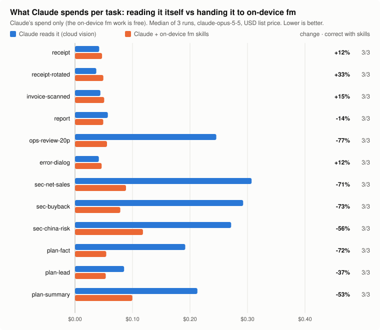

# foundation-model-skills

Claude Code skills that hand document and image reading to **Apple's on-device Vision framework and Foundation Model**. `fm` does the work on your Mac for free, and Claude reads back plain text instead of page images.

Measured against Claude reading the files itself ([benchmark](#benchmark)):

- **Long PDFs are the win.** A 20-page PDF costs **77% less** Claude spend, with the same answers. The saving grows with page count.
- **Your files can stay on your Mac.** OCR and image questions can run entirely on-device when you don't want a document sent to the cloud.
- **Single images and one-page PDFs don't save money.** They cost slightly more (about 5–18%), because skill round trips and the skill listing outweigh one image's tokens. The skills tell Claude to just read those itself.

| Plugin | Use it for | Engine |
|---|---|---|
| `pdf-to-text` | **Any PDF you want Claude to read**, especially multi-page ones. Uses the embedded text layer where present, OCR where not | PDFKit + Apple Vision |
| `ocr` | Many images or scanned pages at once, or any image you want kept on-device | Apple Vision |
| `describe-image` | *Experimental.* Describe an image without it leaving your Mac | Foundation Model (image input), grounded by OCR |
| `ask-image` | *Experimental.* Simple questions about an image without it leaving your Mac | Foundation Model (image input), grounded by OCR |

If you install one, install `pdf-to-text`.

## Requirements

- Apple silicon Mac running **macOS 27 or later** (image input to the on-device model is new in macOS 27)
- Apple Intelligence turned on (System Settings → Apple Intelligence & Siri)

Each plugin bundles a prebuilt `fm` binary (arm64, about 150 KB), so no Xcode is needed to use them.

## Install

```text
/plugin marketplace add goose-farm-future/foundation-model-skills
/plugin install pdf-to-text@foundation-model-skills
/plugin install ocr@foundation-model-skills              # optional
/plugin install describe-image@foundation-model-skills   # optional, experimental
/plugin install ask-image@foundation-model-skills        # optional, experimental
```

Check the on-device model is ready:

```bash
~/.claude/plugins/cache/foundation-model-skills/pdf-to-text/*/bin/fm doctor
```

**Upgrading from 0.1:** the `read-gate` hook has been removed (see [What changed in 0.2](#what-changed-in-02)). Run `/plugin uninstall read-gate@foundation-model-skills`.

## When it saves tokens

Claude pays for three things when it uses a skill:

1. **The skill listing.** Each installed skill's one-line description sits in every session's prompt, about 740 tokens for all four. That's roughly half a cent per session on Opus, cached after the first turn.
2. **The round trip.** Loading the skill, running `fm` and reading its output back adds a turn or two.
3. **The text.** This is usually far smaller than the images of the same pages.

Cloud vision costs about 1–1.5k tokens per image or PDF page. One image never earns back the round trip, but a long PDF does, many times over: Claude can `grep` the extracted text and read only the page it needs.

Claude still does all the reasoning; `fm` only supplies what's on the page. **Pasted images can't be intercepted.** They are sent to the cloud before any skill runs, so save the file to disk and give Claude the path.

## Benchmark

Same prompt, same model, same tools, run through headless Claude Code with and without these plugins: 8 tasks × 2 setups × 3 runs, on `claude-opus-5-5`, 23 Sep 2026.



<!-- BENCH:START -->
| Task | Skill it covers | Claude cost, cloud vision | Claude cost, with skills | Change | Fresh input tokens | Correct, cloud / skills | Claude read the file itself (skills installed) |
|---|---|--:|--:|--:|--:|:-:|:-:|
| `receipt` | ocr | $0.042 | $0.048 | +15% | 4,463 → 5,203 | 3/3 / 3/3 | 3/3 |
| `receipt-rotated` | ocr | $0.037 | $0.041 | +11% | 3,468 → 4,206 | 3/3 / 3/3 | 3/3 |
| `invoice-scanned` | pdf-to-text | $0.044 | $0.052 | +18% | 4,819 → 4,980 | 3/3 / 3/3 | 0/3 |
| `report` | pdf-to-text | $0.057 | $0.052 | -10% | 6,437 → 5,015 | 3/3 / 3/3 | 0/3 |
| `ops-review-20p` | pdf-to-text | $0.246 | $0.057 | -77% | 28,892 → 5,539 | 3/3 / 3/3 | 0/3 |
| `error-dialog` | ask-image | $0.041 | $0.047 | +14% | 4,472 → 5,191 | 3/3 / 3/3 | 3/3 |
| `chart` | describe-image | $0.047 | $0.049 | +5% | 4,465 → 5,198 | 3/3 / 3/3 | 3/3 |
| `visitors` | ask-image | $0.043 | $0.048 | +12% | 4,466 → 5,199 | 3/3 / 3/3 | 3/3 |
| **All tasks** | | **$0.557** | **$0.395** | **-29%** | | | |
<!-- BENCH:END -->

- Costs are **Claude's spend only**, at list price as reported by the Claude Code CLI; the `fm` work itself is free.
- That price weights fresh input, cache writes, cache reads and output correctly.
- "Fresh input tokens" are uncached input (where image and document tokens land), median per run.
- Each run is a new session, so the skill-listing cost is charged on every task here. In normal use it's paid once per session, which makes the single-image overhead smaller than shown.

### What it shows

- **Multi-page PDFs: large savings.** For the 20-page PDF, fresh input drops from ~28.9k to ~5.5k tokens and spend drops 77% ($0.246 → $0.057). Claude pipes the extracted text through `grep`, finds the one page that matters, and never looks at the other 19. A 2-page PDF saves 10%.
- **Single images and one-page PDFs: a small cost, not a saving.** Claude reads single images itself, as the skills tell it to, so the only difference is the skill listing (+5% to +15%). A one-page scanned PDF still goes through `pdf-to-text` and costs 18% more than reading it directly.
- **The whole suite: 29% less** ($0.557 → $0.395), almost all of it from the long PDF. More pages means a bigger saving.
- **Latency:** about 8.7 s per task with the skills vs 6.6 s without.

### Quality

- **No accuracy lost.** All 24 runs with the skills were correct, same as without.
- **Text extraction is exact where it's used.** For both the text-layer PDFs and the scanned invoice, Claude's answers matched the source every time.
- **The raw `fm` output isn't always clean.** Scored against the source text by `bench/ocr_accuracy.py`:

  | Input · command | Similarity to source |
  |---|--:|
  | receipt.png · ocr | 100.0% |
  | receipt-rotated.png · ocr | 50.5% |
  | report.pdf · pdf-to-text (text layer) | 100.0% |
  | report.pdf · pdf-to-text --force-ocr | 93.7% |

  - The rotated receipt's characters are all correct, but the lines come back reversed and joined, so the score is low.
  - Forced OCR misread one word ("sevenue") and dropped a section heading.
  - The text-layer path (the default) is exact, so use `--force-ocr` only on pages that need it.
- **The on-device model is weak at visual judgement.** Asked which month had the fewest visitors on an unlabelled line chart, `fm ask-image` answers "March" (it's May). That's why `describe-image` and `ask-image` are marked experimental and Claude is told to read charts itself.

### What changed in 0.2

Version 0.1 steered every image and PDF to the skills, and shipped a `read-gate` hook that blocked Claude's first `Read` of any image or PDF. The same benchmark on 0.1 (`bench/results/runs-v0.1.jsonl`) showed:

- **Single images cost 4–30% more.** The on-device round trip cost more than the image it replaced.
- **The on-device model got the chart question wrong, and Claude passed that answer on in 1 of 3 runs.** In the other 2, the hook's forced detour cost 73% more than reading the image directly.
- **`read-gate` never helped.** In all 24 runs Claude chose the skill on its own, so the hook only fired when Claude legitimately needed the image, and there it just added turns.

So 0.2 removes `read-gate`, rewrites the skill descriptions to send only the cases that pay off (PDFs, bulk work, privacy) to the skills, and teaches `pdf-to-text` to search long PDFs instead of reading them whole. Result: the suite went from 22% to **29% less**, the 20-page PDF from 69% to **77% less**, and accuracy from 23/24 to **24/24**.

### Reproduce it

```bash
bench/run.py                               # all tasks, both setups, 3 runs (~$3 at list price on Opus)
bench/run.py --tasks ops-review-20p --reps 1 --model claude-sonnet-5
bench/report.py                            # rebuilds the chart, bench/results/summary.md and the table above
bench/ocr_accuracy.py                      # fm output vs source text, no Claude calls (free)
```

- **Setup:** needs the `claude` CLI signed in, and macOS 27 with Apple Intelligence on.
- **Fair comparison:** both setups get the same tools (`Read`, `Bash`, `Skill`), project-only settings and no MCP servers. The only difference is `--plugin-dir` for this repo's plugins.
- **No cache sharing between runs:** each prompt carries a unique tag, so every run pays for its image or PDF as a first read would.
- **Adding a task:** tasks, expected answers and fixtures are in `bench/tasks.json` and `bench/fixtures/` (HTML/text sources in `bench/fixtures/src/`). Add a task by adding a line there.
- **What's recorded:** each run is appended to `bench/results/runs.jsonl` with token counts, cost, turns, `fm` calls, whether Claude read the file itself, and Claude's answer. Full transcripts go to `bench/results/raw/` (git-ignored).

## What to trust

- **Vision OCR (`ocr`, `pdf-to-text`)** gets characters right: numbers, dates, names and codes. Reading order can break on rotated or multi-column pages.
- **PDF text layers can be incomplete.** E-signature fields, filled-in forms, stamps and annotations are often missing. Use `pdf-to-text --force-ocr` on those pages, or `ocr`.
- **The on-device model (`describe-image`, `ask-image`)** is small (~3B parameters).
  - It's fine for "what kind of document or UI is this" and for text printed in the image; OCR text is passed in as the authoritative source.
  - It can't be trusted to read chart shapes, compare visual sizes or judge a design. Let Claude read those images itself.

## The `fm` CLI

```text
fm pdf-to-text    <file.pdf>  [--pages N|N-M] [--max-pages N] [--force-ocr]
fm ocr            <image|pdf> [--pages N|N-M]
fm describe-image <image|pdf> [--pages N|N-M]
fm ask-image      <image|pdf> "<question>" [--pages N|N-M]
fm doctor
```

## Development

```text
src/main.swift          the fm CLI (single file)
scripts/build.sh        compile fm and bundle it into every plugin that uses it
scripts/fm-wrapper.zsh  launcher copied to plugins/*/bin/fm
plugins/<task>/         one plugin per task: .claude-plugin/plugin.json, skills/<task>/SKILL.md, bin/
tests/smoke.sh          end-to-end check against tests/fixtures
bench/                  token and quality benchmark: run.py, report.py, ocr_accuracy.py, tasks.json, fixtures/, results/
```

Building needs Xcode (or Xcode-beta) with the macOS 27+ SDK. The Command Line Tools SDK may lag behind and lack image input.

```bash
scripts/build.sh && tests/smoke.sh
claude plugin validate .
```

### Adding a skill

1. Add a subcommand to `src/main.swift`, named after the task.
2. Create `plugins/<task>/` with `.claude-plugin/plugin.json` and `skills/<task>/SKILL.md`. The skill calls `"${CLAUDE_PLUGIN_ROOT}/bin/fm" <task> ...`.
3. Add the plugin to `scripts/build.sh`, `.claude-plugin/marketplace.json`, `tests/smoke.sh` and `bench/run.py`, with at least one task in `bench/tasks.json`.
4. Keep each skill narrow, and keep the description short. Every installed description is paid for in every session, so say when to use the skill *and* when not to.
5. Benchmark it before claiming a saving. The skill round trip has a fixed cost, so only inputs bigger than that come out ahead.

### Ideas

The benchmark says the wins come from shrinking big inputs before Claude reads them:

- `condense`: cut long logs, test output and CI failures down on-device, keeping error lines verbatim
- `extract`: structured output that fills a fixed schema, for bulk field extraction (200 invoices → one table)
- `classify`: bulk tagging with the model's `.contentTagging` mode
- `transcribe-audio`: on-device speech-to-text (Speech framework), for input Claude can't take directly
- A Private Cloud Compute tier: macOS 27's `PrivateCloudComputeLanguageModel` (32k context, reasoning, free with a usage cap) might handle the visual questions the on-device model gets wrong. It runs on Apple's servers, not on your Mac, so it would need to be opt-in.

## License

MIT
